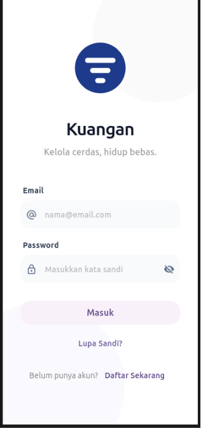
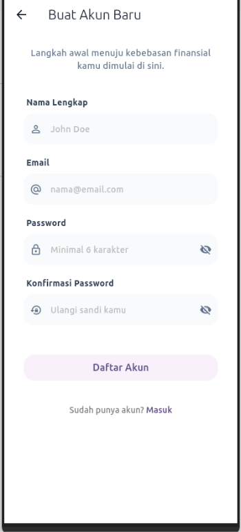

# 📱 Kuangan App
> Aplikasi manajemen keuangan sederhana berbasis Flutter

---

## ✨ Deskripsi
**Kuangan** adalah aplikasi mobile yang membantu pengguna mengelola keuangan secara praktis.  
Dirancang dengan tampilan modern dan ringan, cocok untuk pembelajaran maupun penggunaan sehari-hari.

---

## 🚀 Fitur Utama
- 🔐 Login & Register user  
- 💰 Manajemen saldo  
- 📊 Dashboard keuangan  
- 🔄 Transfer & top-up saldo  
- 🧾 Penyimpanan data lokal  

---

## 🖼️ Tampilan Aplikasi

### 🔑 Login Screen
<p align="center">
  
</p>

### 📝 Register Screen
<p align="center">
  
</p>

> 📌 **Catatan:**  
> Pastikan file screenshot ada di folder:  
> `assets/screenshots/`

---

## 🛠️ Teknologi yang Digunakan
- Flutter  
- Dart  
- Local Storage (SharedPreferences / custom)  
- SVG Support  

---

## 📂 Struktur Project
```bash
lib/
 ├── main.dart
 ├── pages/
 ├── widgets/
 └── services/
